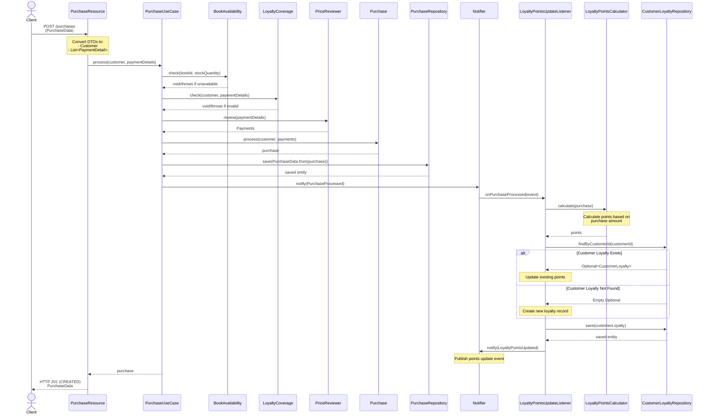

# WorkLog

This file documents my thought process, design decisions and implementation progress in chronological order.

## Technical Disclaimer

While defining [the development guideline](https://github.com/danilo-ambrosio/bookstore/blob/master/README.md), I didn't
follow an MVP perspective/compressed architecture approach despite
the few functional requirements and minor essential complexity. Aware of adding excessive design sophistication in the
codebase,
my idea is to show some important elements of my knowledge background, letting Sporty hiring team know a subset of my
main technical skills.
Those concepts have been a solid foundation in my career to build successful solutions, working on high performance
teams and meeting modern
software requirements: scalability, responsiveness, maintainability, etc.

### 1: Requirements Analysis

First, I carefully read the functional requirements, spending more time with those would require more business logic (
e.g. price/discount calculation).
In this phase, I like to draw class or sequence diagrams. Not much for documentation purpose, but mostly as design
process helper.
Here's the first domain modeling draft on my whiteboard:

Manual drawing also helps me to roughly foresee architecture decisions and some required building blocks (entities,
value objects, tests, controllers, so on).

By knowing that, I can also estimate the effort for each use case/user story. These bullets become fine-grained tasks
that provides a more accurate personal progress indicator.
Self time management gives peace of mind about not being delayed and is easier to do when the time box for each amount
of work to be completed is short. The smaller sub tasks are,
the better to have an accurate progress indicator.

### 2: Initial setup

Created project basic structure and added maven configuration.

### 3: Domain Modeling and Unit Tests

Having in mind the rule of inward dependency sense (Clean Architecture) and the primacy of Domain concerns (DDD), I
decided to start this project by working on the domain model, more specifically in, what I called, the inventory domain.
Before implementing any production code, created some test units for the first
aggregate [inventory.Book](https://github.com/danilo-ambrosio/bookstore/blob/master/src/main/java/com/sporty/bookstore/domain/model/inventory/Book.java)
which
allowed me to understand what would be the public methods, arguments, return types, etc...
Next, once the test assertions were already in place, I implemented the code to make tests green. At this early
implementation step, following what I drew
in [this diagram](https://github.com/danilo-ambrosio/bookstore/blob/master/assets/grooming/initial-class-diagram.jpg),
I noticed something confusing in my first domain class: the purpose
of [inventory.Book](https://github.com/danilo-ambrosio/bookstore/blob/master/src/main/java/com/sporty/bookstore/domain/model/inventory/Book.java)
was initially to deal with
inventory operations, but I ended up adding logic related to financial processes. Result: too much responsibility for a
class. Such mistake reminded me of one of the golden rules of DDD: keep your aggregates smaller as much as possible.
From experience, I know
that's also good for scalability and responsiveness.

### 4: Rethinking domain model, Value Objects and Integration Tests

Still in the inventory domain, I intentionally made all Book attributes as Value Objects. Among many benefits, this
pattern makes code readable and methods easier to use.

In this step, I also implemented Repositories, Use Cases and Rest API which allowed to cover many parts of the code 
with some integration test cases.
By the way, this level of testing
required some 
greater 
effort due to an unsuccessful
embedded MongoDB setup, but, in the end, it really paid off (later, I'll tell why). As I adopted a kind of broader scope
for integration tests
by not mocking DB, [TestContainers](https://testcontainers.com/) met what I expected in terms of having a test
environment closer to the reality.

I decided to use MongoDB because Repositories executed only simple queries and only weak dependency/relationship 
between entities.

### 5: Pricing feature

This part also required a thorough modeling. I've already worked on projects dealing with monetary values and 
learned that the best approach for consistency and maintainability is to fully encapsulate every calculation 
and rounding in a Value Object ([Price](https://github.com/danilo-ambrosio/bookstore/blob/4b4f2e35a2a6a5804278ed546de932c94f164e22/src/main/java/com/sporty/bookstore/domain/model/pricing/Price.java#L14)).

### 6: Discount policies

In regard to discount policies/book types (NEW_RELEASE, OLD_EDITION, REGULAR_EDITION), I originally thought a State 
Pattern implementation applied to [Book](https://github.com/danilo-ambrosio/bookstore/blob/4b4f2e35a2a6a5804278ed546de932c94f164e22/src/main/java/com/sporty/bookstore/domain/model/pricing/Book.java) combined with [JPA/DiscriminatorType](https://docs.jboss.org/hibernate/jpa/2.1/api/javax/persistence/DiscriminatorColumn.html) 
to automatically fetch the proper subclass from DB. Soon I noticed an approach more like 
"composition over inheritance" would fit better, so I took [Strategy](https://refactoring.guru/design-patterns/strategy) pattern instead.

### 7: Loyalty and Domain Events

I intentionally left the Loyalty Program implementation for last because it depends on the other features. Thinking 
of Loyalty invariants, I decided to create [Points](https://github.com/danilo-ambrosio/bookstore/blob/4b4f2e35a2a6a5804278ed546de932c94f164e22/src/main/java/com/sporty/bookstore/domain/model/loyalty/Points.java)
to centralize the proportion of consumed points versus purchased books. 
In this step, I also introduced [Domain Events](https://martinfowler.com/eaaDev/DomainEvent.html) along with a 
[collection 
of classes](https://github.com/danilo-ambrosio/bookstore/tree/master/src/main/java/com/sporty/bookstore/domain/model/event) to support this tactical DDD pattern, having in mind 
that, usually in real scenarios, Loyalty Points may be eventually consistent (i.e. asynchronously updated).

For a better understanding of how everything is wired, here's a sequence diagram of the purchase book operation and its async/non-blocking side effect on
Loyalty domain model:

